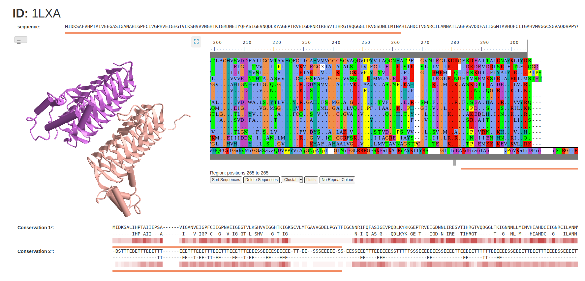

# Graficador de zonas conservadas de proteínas



## Informacion de proyecto

* La información de los cambios en el proyecto posteriores a la entrega esta [aquí](./docs/cambios-post-demo.md)

El proyecto esta desarrollado en Django con la intención de publicar un sitio que pueda ser consumido en una red interna desde cualquier navegador. El uso de esta herramienta también nos da la posibilidad de usar Python para desarrollar la lógica del back-end. A la par, utilizamos Pipenv para el manejo de dependencias del proyecto.
A continuación se detallan algunas dependencias del proyecto:
* Back-end:
  * django
  * biopython
  * Clustal
  * DSSP
* Front-end:
  * [iCn3D](https://github.com/ncbi/icn3d)
  * [JSAV](https://github.com/AndrewCRMartin/JSAV)

## Logica de procesamiento
La logica definida para procesar y obtener la informacion necesaria del proyecto se podra encontrar en la carpeta `./tp_final/core/`. 

### `main.py`
 El archivo `main.py` contiene los pasos necesarios para generar las zonas conservadas de una proteína sin necesidad de montar el proyecto en django.
 Se pueden modificar los parametros: PDB_ID, e-value maximo, porcentaje de conservación para la secuencia consenso.
 
 Con solo correrlo el programa descargará los archivos necesarios de Blast, Clustal y PDB para poder hacer las comparaciones.
 Todos los archivos serán alojados en una carpeta `repository` en el root del proyecto.
 El programa `main` imprimirá por consola los resultados, primero una lista de tuplas (Aminoacido, porcentaje) donde se mostrará el porcentaje de conservación del aminoacido con mas apariciones.
 Tambien se verá la secuencia consenso que supere el valor porcentual que se ingreso.
 
 ### `dssp.py`
 Es necesario correr el archivo `dssp.py` luego de haber ejecutado `main.py`. Este programa nos mostrara la estructura secundaria consenso y la lista de pares (Estructura del aminoacido, porcentaje) en el mismo formato que `main.py`  

## Servicios utilizados

* Descarga de pdb para visor 3d 
  https://files.rcsb.org/view/
* Descarga de pdb para alineamientos en visor 3d
  https://opm-assets.storage.googleapis.com/pdb/
* Descarga de archivos fasta
  https://www.rcsb.org/fasta/entry/
* Descarga de archivos pdb
  https://files.rcsb.org/download/
* Consulta de proteinas homologas por blast de biopython
  http://ncbi.github.io/blast-cloud/dev/api.html


## Instalacion

Descargar una copia del proyecto en la direccion donde desee montar el servicio.
Ejecutar en consola los siguientes comandos para instalar las dependencias:

```bash
pip install pipenv #Instalar PipEnv
sudo apt-get install dssp #Instalar DSSP
sudo apt-get install clustalw #Instalar clustalw
```

## Ejecucion

Abrir una ventana de terminal ubicada en el root del proyecto y correr los siguentes comandos:

```bash
pipenv shell #Montar ambiente
```
```bash
pipenv run py manage.py runserver #Iniciar django desde pipenv
```

## Uso de la herramienta

Una vez montado el servicio, ingresar a la pagina http://127.0.0.1:8000/ donde será redirigido a un formulario con los parametros necesarios para realizar el procesamiento:
* PDB id
* E-Value limite
* limite de conservacion de aminoacido/estructura

Una vez completada esta informacion, presionar el boton `Request` para que se muestre la informacion obtenida y procesada de la estructura y conservacion de las proteinas homologas.
