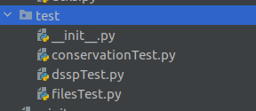

# Cambios posteriores a la demo

## Mejoras en la interacción con el usuario.
- Agregamos labels en la pagina de inicio para reconocer mejor los campos.

- Explicitamos claramente los labels de conservacion 1° y 2°

## Testing

- Agregamos tests a los algoritmos de conservacion primaria y secundaria y al fetching de datos de PDB.

## Gaps de Clustal
Teniamos un inconveniento con `clustalw`, figuraban gaps en todas las secuencias alineadas en una misma posicion.

- Modificamos la penalidad de los gaps en `clustalw` y solucionamos el problema.

 